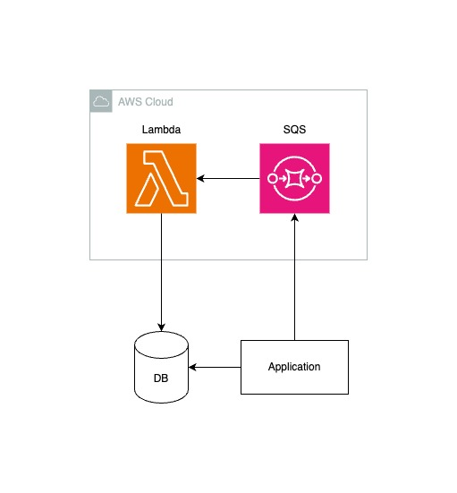

# learn-sqs
sqsの学習を目的にしたwebアプリケーション開発リポジトリ

# require
- docker
- docker-compose
- atlas

# システム構成図



# Usage

```shell
docker-compose up -d
curl localhost:8080/health
```

# migration

```shell
cd app/cmd/migrate
atlas migrate diff --env "gorm"
cd -
```

```shell
docker-compose up migrate
```


# lambda
ログ確認
```shell
aws --endpoint-url=http://localhost:4566 logs filter-log-events \
--log-group-name /aws/lambda/handler \
--query "events[].[message]" \
--output text

```
